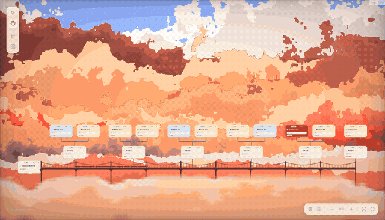
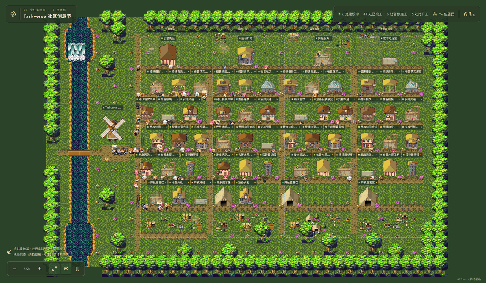
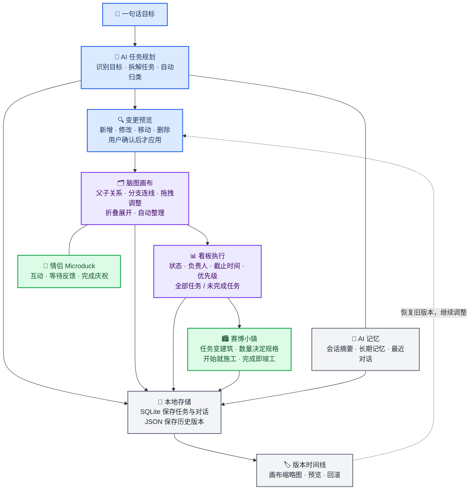
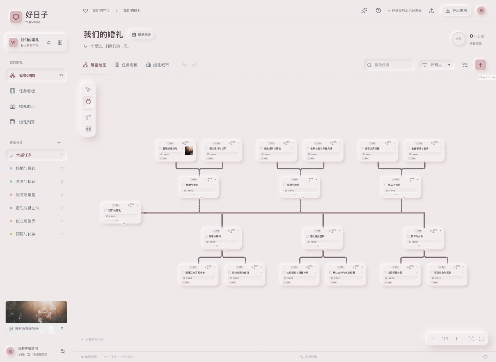
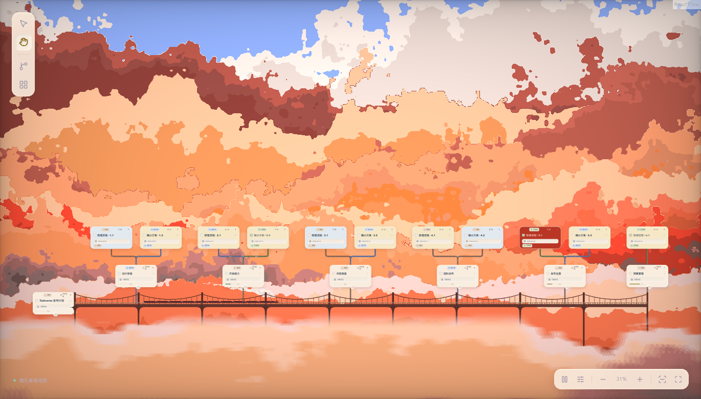
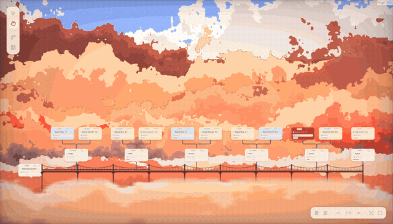
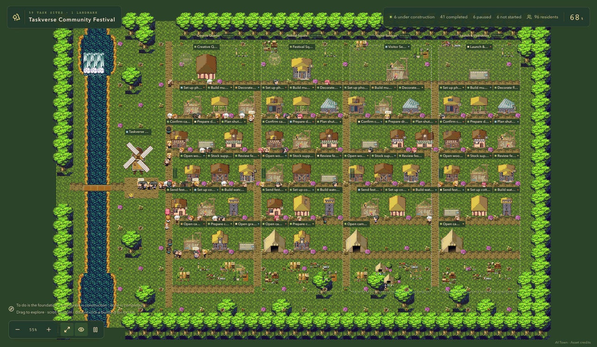
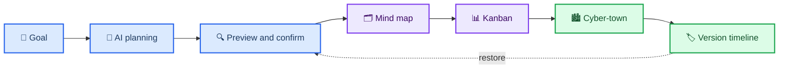
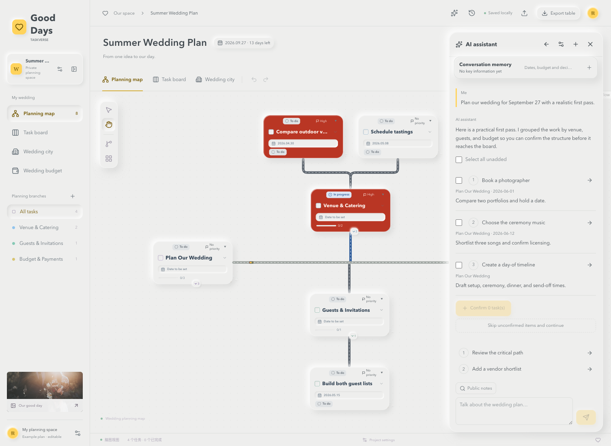

# Taskverse

**今天就出发 · 让想法上车，让计划启程。**



**小镇养成记 · 每完成一件事，你的世界就长大一点。**



[中文介绍](#中文介绍) · [English](#english-documentation) · [快速启动](#-快速启动) · [Credits](#-致谢与来源)

### AI task planning · visual mind map · kanban execution · cyber-town growth

    


## 中文介绍

**Taskverse 把 AI、脑图、看板和赛博小镇放进同一个任务工作台。** 你说清楚目标，AI 帮你识别和拆解任务；脑图负责整理关系，看板负责推进执行，城市视图把任务量和完成度变成街区、工地和竣工的建筑。所有视图读写同一份任务数据。

> **把一堆待办，变成一座会生长的城市。**

应用默认提供婚礼筹备模板；公开演示还包括发布计划和社区创意节。你也可以用它规划旅行、研究课题或其他长期任务。

## 🧭 产品闭环



AI 提出的画布变更经用户确认后才保存。脑图、看板和小镇可随时切换，共享同一份任务数据；保存有变化的项目时会保留旧版本，方便从版本缩略图预览和恢复。

## ✨ 能力与演示

| 能力 | 你可以做什么 | 演示 |
| --- | --- | --- |
| **AI 画布操作** | 新增、修改、移动、排序、删除和归类任务，逐项确认后应用 | [AI 对话](docs/screenshots/capability-ai.png) · [变更预览](docs/screenshots/capability-ai-canvas.png) |
| **自动拆解与归类** | 从自然语言提取任务、负责人、日期、优先级和父子归属 | [规划示例](docs/screenshots/capability-ai-planning.png) |
| **脑图与树状视图** | 编辑父子关系、折叠展开、自动整理、键盘导航和拖拽重排 | [脑图示例](docs/screenshots/capability-mindmap.png) |
| **看板执行** | 按状态、分支、负责人筛选，切换全部任务／未完成任务 | [看板示例](docs/screenshots/capability-kanban.png) |
| **赛博小镇** | 每个任务对应一块地，任务量决定建筑规格，状态决定待开工、施工、停工和竣工 | [真实运行演示](docs/screenshots/cyber-town.gif) |
| **版本时间线** | 用任务结构缩略图预览、恢复和继续编辑 | [版本示例](docs/screenshots/capability-versions.png) |
| **AI 记忆与续聊** | 保存会话摘要、婚期、预算、偏好和已确认决策 | [记忆示例](docs/screenshots/capability-ai-memory.png) |
| **情侣 Microduck** | 走路、歪头、叼物、跌倒起身、等待和完成庆祝 | [宠物示例](docs/screenshots/capability-pets.png) |

### 两个主推主题

**雾玫瑰**是轻盈的 Soft UI 工作台，适合专注整理任务。**云间列车**把脑图中心轴变成固定桥梁和铁轨：远云缓慢流动，近云快速掠过，多节列车持续驶过，并可实时调整云量、亮度、速度、画质和运动模糊。

| 主题 | 预览 |
| --- | --- |
| 雾玫瑰 · Mist Rose |  |
| 云间列车 · Cloud Railway |  |

[观看中文云海列车动图](docs/screenshots/cloud-railway.gif) · [打开云海参数面板](docs/screenshots/capability-cloud-controls.png)

### 赛博小镇：做完一件事，城里多一座建好的楼

脑图里的任务会落到小镇里：分支组成街区，任务名称挂上建筑招牌，任务组越大，建筑规格越高。小人沿道路走动，施工队搬料、砌墙、操作吊机；你完成任务，对应的工地就变成一座完整建筑。点击建筑查看任务，双击打开详情，也能直接定位回脑图。


| 任务状态 | 小镇里的样子 |
| --- | --- |
| 待办 | 预留地基，等待开工 |
| 进行中 | 脚手架、吊机和忙碌的工人 |
| 等回复 | 暂停标牌、盖好的物料、停止施工的工地 |
| 已完成 | 完整的房屋、商店、旅馆、礼堂等建筑 |

上面是 **60 个示例任务节点**：**59 个任务地块＋1 座根节点风车**。59 个地块中有 41 处竣工、6 处施工、6 处暂停、6 处待开工。建筑数量随任务变化；居民是场景角色，不计入任务或建筑数量。

小镇动图直接录制应用运行画面，保留原生居民、风车、水流和施工动画。中英文演示均使用隔离的合成任务数据，项目和聊天 API 全部拦截，不使用本机用户项目。云海动图同样来自真实应用的 8 秒循环录屏。

## 🚀 快速启动

需要 **Node.js 22.13+** 和 npm。在项目目录运行。macOS 固定启动入口：

```bash
git clone https://github.com/lailoo/Taskverse.git
cd Taskverse
npm ci
npm run start:local
```

打开 <http://127.0.0.1:3010>。macOS 也可以双击根目录的 `启动婚礼筹备.command`。其他系统或开发调试使用：

```bash
npm run dev -- --hostname 127.0.0.1 --port 3010
```

固定启动入口会复用已有服务，否则构建并启动后台服务。电脑重启后再次运行入口即可打开原项目；项目数据保存在 `.local/`，不会因重启丢失。

## 🛠️ 日常使用

### 任务画布

- 单击卡片选择任务，双击标题或空白处打开完整详情。
- `Tab` 新增子任务，`Shift+Tab` 新增同级任务；方向键切换节点。
- 树状任务表中，`Enter` 新增子任务，`Shift+Enter` 新增同级任务。
- 拖到卡片中央接入为子任务，拖到左右侧调整同级顺序；整棵子树会一起移动。
- `Space` 切换完成状态，`F2` 编辑名称，`Delete`／`Backspace` 删除任务（确认后执行）。
- `Cmd/Ctrl+Z` 撤销；导出生成 Excel，JSON 仅用于内部备份和恢复。

### AI 助手

打开 AI 助手后可以新建会话或选择历史会话续聊。输入消息时 `Enter` 发送，`Shift+Enter` 换行。生成中的下一条消息会进入等待队列；上一轮有未处理的任务建议时，队列会暂停，直到你确认、跳过或编辑建议。

AI 回复支持流式 Markdown 和思考内容展示。停止、Steer、超时或断线会保留已经收到的内容；不完整的任务协议不会修改画布。新增、修改、移动、排序和删除都会先显示画布预览，必须点击确认才会写入项目。

### 语言与主题

在 **项目设置** 中切换中文、English、Français、日本語或 한국어。主要界面跟随所选语言，部分次级界面仍有中文或英文回退文案；AI 按所选语言请求回复，任务标题和描述保持原文。主题选择器主推雾玫瑰与云间列车。

## 🤖 AI 配置

在 AI 助手中打开 **模型设置**，填写服务商、兼容接口基础地址、模型名称和 API Key。支持 OpenAI、DeepSeek、通义千问及 OpenAI 兼容接口。

点击 **测试并保存** 后，服务端会先验证连接和 JSON 回复能力；测试失败时不会覆盖旧配置。配置也可以放在 `.env.example` 对应的本地环境变量中，界面配置优先。详细说明见 [AI 接入说明](docs/ai-setup.md)。

## 💾 本地数据与备份

| 路径 | 内容 |
| --- | --- |
| `.local/wedding.sqlite` | 任务、层级、图片、优先级、预算和婚期 |
| `.local/chats.sqlite` | 会话、消息、摘要、长期记忆和建议处理状态 |
| `.local/backups/project-*.json` | 最近 30 份项目自动快照 |
| `.local/ai-config.json` | 服务端模型配置和 API Key |
| `.local/server.log` | 本地启动日志 |

重启或重新构建不会清空数据。每次真实项目修改会在保存前备份旧版本，版本栏可以预览和恢复。迁移数据时先停止服务，再整体备份 `.local/`；不要在服务运行时单独复制 SQLite 主文件。`.local/`、密钥和个人数据已被 Git 忽略。

## 🧱 技术结构

- **Web**：Next.js 16、React 19、TypeScript、React Flow、Dagre、d3-hierarchy、Lucide
- **AI**：流式 SSE、Markdown/GFM、会话队列、摘要和长期记忆、画布变更协议
- **存储**：Node.js 内置 SQLite、项目快照、JSON 备份、Excel 导出
- **视觉**：CSS 主题、WebGL2 GLSL 云海渲染、固定铁路、多节列车、Canvas 2D 像素小镇
- **陪伴**：两只 Microduck-inspired 宠物及动作状态模拟

```text
src/app/                  页面、全局样式与服务端 API
src/app/api/project/      项目读取、保存、版本和备份
src/app/api/chats/        会话读取与保存
src/app/api/ai/           模型调用、配置和连通性测试
src/components/wedding/   脑图、看板、城市、AI、宠物和主题场景
src/lib/                  任务规则、布局、存储、流式解析和渲染辅助
scripts/                  本地启动、截图和演示数据脚本
tests/                    单元测试与浏览器回归检查
```

## ✅ 开发与验证

```bash
npm run typecheck
npm test
npm run build
```

云海主题浏览器回归：

```bash
node --import tsx tests/cloud-controls-browser.cjs
node --import tsx tests/cloud-train-browser.cjs
```

重新生成公开演示素材（使用拦截 API 的独立示例数据）：

```bash
npm run screenshots:ai
npm run screenshots:cloud
node --import tsx scripts/capture-town-demo.cjs
```

`npm run screenshots:cloud` 需要 FFmpeg 和可用的 Chrome，生成中英文云海 GIF、静态预览和 60 任务密度的参数面板截图。可以设置 `CLOUD_TEST_URL`、`PLAYWRIGHT_MODULE` 或 `FFMPEG_PATH` 指向自定义环境。

录制前先启动应用，并安装 Playwright（`npm install --no-save playwright`）。AI 截图使用预设对话和响应展示交互，不代表一次真实模型调用的测试结果；云海和小镇 GIF 则是运行中页面的逐帧录制。

小镇录屏运行 `node --import tsx scripts/capture-town-demo.cjs`，默认连接本地 3010 端口，可通过 `TOWN_TEST_URL` 调整。脚本检查任务与地块一一对应、四种施工状态、逐帧动画变化和原生暂停，并生成中英文 GIF、截图及数量核对记录。

## ⚠️ 使用边界

- 当前是本机单项目工作区，没有账户体系、多人权限或公网部署加固。
- 单项目最多 500 个任务；每项最多 8 张图片，项目图片总量上限为 40 MiB。
- AI 调用需要联网和可用额度，可能产生服务商费用。
- Microduck 和云海列车是浏览器视觉模拟；宠物动作不是原始机器人策略，云海效果基于参考 ShaderToy/WebGL 作品适配。

## English documentation

**Your journey starts today · Bring your ideas aboard. Set your plans in motion.**



**Grow your little town · With every task you finish, your world grows a little more.**



### What Taskverse does

**Taskverse turns one goal into a living workspace.** AI identifies and decomposes the work; the visual task graph organizes relationships; the kanban board tracks execution; and the cyber-town view turns workload into districts, construction sites and completed buildings. Every view shares the same task tree.



### Primary experiences

- **AI canvas operations** — create, edit, move, reorder, classify, or delete tasks through a confirmation preview.
- **Mind map and kanban** — edit the same task tree in relationship and execution views.
- **Cyber-town progression** — tasks become building sites, task groups form districts, and completed work becomes finished architecture.
- **Version timeline** — inspect visual task-tree thumbnails and restore a previous plan.
- **Cloud Railway** — a fixed railway, multi-car train, and evolving WebGL cloud layers. Watch the [English animation](docs/screenshots/cloud-railway-en.gif) or open the [controls screenshot](docs/screenshots/capability-cloud-controls.png).
- **Companion ducks** — lightweight walking, idle, waiting, interaction, and celebration animations.

The interface offers Chinese, English, French, Japanese, and Korean; some secondary screens still contain Chinese or English fallback text. Task content stays in the language you entered. AI replies are requested in the selected language.

### AI planning and canvas changes

Describe your goal, review the proposed tasks, and confirm the changes you want. The assistant can suggest additions, edits, moves and deletions. Conversation history, summaries and remembered decisions support follow-up planning; queued messages wait while earlier suggestions need attention.



[Canvas change preview](./docs/screenshots/capability-ai-canvas.png) · [Conversation memory](./docs/screenshots/capability-ai-memory.png)

### Cyber-town: finish a task, finish a building

Your task tree becomes a town you can explore. Branches form districts, task names appear on buildings, and larger task groups get larger buildings. Residents walk along the streets while construction crews carry materials, build walls and operate cranes. Click a building to inspect its task, double-click for full details, or jump back to its mind-map node.


| Task state | In the town |
| --- | --- |
| To do | A reserved foundation, ready for work |
| In progress | Scaffolding, a crane and working builders |
| Waiting | A pause sign, covered materials and an idle construction site |
| Done | A finished home, shop, lodge, hall or other building |

This example has **60 task nodes: 59 task sites and one root-node windmill**. The sites comprise **41 completed, 6 under construction, 6 paused and 6 not started**. Site counts follow the task data; residents are scene characters, not extra tasks or buildings.

The GIF is a direct recording of the running application, including its native residents, windmill, water and construction animation. English task names belong to an isolated synthetic project. Reproduce it with `node --import tsx scripts/capture-town-demo.cjs`; the capture checks rendered counts, construction states, changing animation frames and the app's pause control.

### Quick start

```bash
npm install
npm run dev -- --hostname 127.0.0.1 --port 3010
```

Requires **Node.js 22.13+**. Open <http://127.0.0.1:3010>. On macOS, `npm run start:local` builds the app and starts it in the background; run it again after a restart to reopen the project. Configure a provider in **AI Assistant → Model Settings** and use **Test and save** before sending requests.

SQLite stores the current project and conversations. JSON backups preserve the previous project versions (the latest 30 are retained). All remain under `.local/`, which is ignored by Git. Stop the service before copying this directory to another computer. This is a local, single-project workspace without multi-user accounts or public deployment hardening.

### Validation and demo assets

```bash
npm run typecheck
npm test
npm run build
npm run screenshots:cloud
```

Start the app before capturing demos. Capture tools require Playwright and Chrome; GIF recording also requires FFmpeg. The capture scripts use isolated synthetic projects. AI screenshots contain scripted conversations and responses, not live model evaluation results. Cloud Railway and Cyber-town GIFs record the running application directly.

## 🙏 致谢与来源

### 赛博小镇 / Cyber-town

赛博小镇使用 [AI Town](https://github.com/a16z-infra/ai-town) 的像素地图、居民、风车、水流和营火素材，感谢原项目及美术作者 **hilau、George Bailey、bluecarrot16、ansimuz**。Taskverse 在这些素材基础上扩展了任务建筑、街区布局和施工状态联动；这些扩展不属于 AI Town 官方素材。

Cyber-town uses pixel-art and animation assets from [AI Town](https://github.com/a16z-infra/ai-town). Thanks to the project and artists **hilau, George Bailey, bluecarrot16, and ansimuz**. Taskverse adds task-based buildings, district layouts, and construction states; these extensions are not official AI Town assets.

AI Town 的 MIT 代码许可不覆盖全部第三方美术。相关扩展建筑采用 **CC BY-SA 3.0**；逐项来源、作者链接和许可说明见 [地图素材来源](public/assets/ai-town/SOURCES.md) 与 [扩展建筑署名](public/assets/ai-town/buildings/SOURCES.md)。The MIT code license does not cover all third-party artwork; see these asset-specific credits and licenses before redistribution.

### 云间列车 / Cloud Railway

云间列车的云海与火车视觉效果致谢 **Tianxiu（Tyson）Zhou** 的作品 [Up in the Cloud Sea](https://people.tamu.edu/~choutianxius/csce646/pr01/index.html)，以及其公开说明中提到的 [mdb ShaderToy 作品](https://www.shadertoy.com/view/Ndc3zl)。本项目在此基础上进行了脑图中心轴适配、固定桥梁与铁轨、多节列车布局、远近云层速度控制和 WebGL 参数化扩展。

The Cloud Railway scene is inspired by **Tianxiu (Tyson) Zhou's** [Up in the Cloud Sea](https://people.tamu.edu/~choutianxius/csce646/pr01/index.html) and the [mdb ShaderToy work](https://www.shadertoy.com/view/Ndc3zl) referenced by the author. This project adapts the visual to a task-map axis and adds the fixed bridge and railway, multi-car layout, independent near/far cloud speeds, and parameter controls. See the full provenance record in [`docs/references/up-in-the-cloud-sea/`](docs/references/up-in-the-cloud-sea/).

### Microduck

宠物外观参考 **Pollen Robotics** 的 [Microduck](https://github.com/pollen-robotics/microduck_rl)，模型由其机器人资源转换而来。网页互动是本项目编写的动画，不是强化学习策略的运行结果。

Pet models are adapted from **Pollen Robotics' Microduck** robot assets under **Apache-2.0**. Browser interactions use custom animation, not the trained robot policies. See [model provenance](public/models/microduck/SOURCE.json) and [license](public/models/microduck/LICENSE).

## License

The application code is released under the [MIT License](LICENSE), copyright 2026 lailoo. Third-party artwork, robot models and shaders retain their own licenses. See [third-party notices and pending asset verification](THIRD_PARTY_NOTICES.md) before redistributing them. Local deployment and data boundaries are documented in [SECURITY.md](SECURITY.md).
